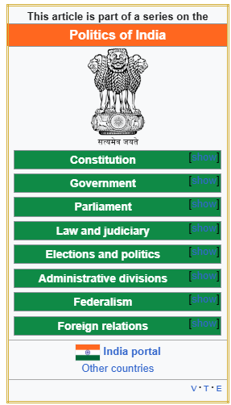
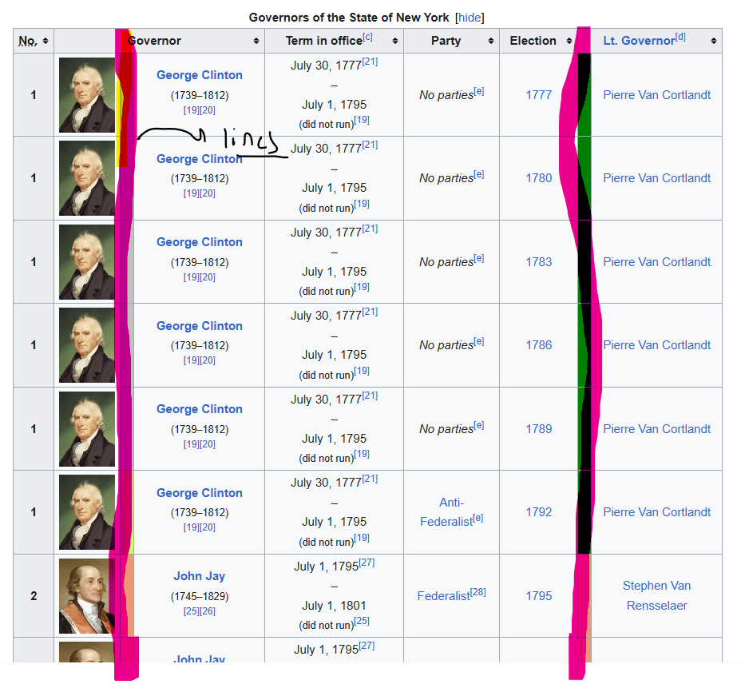
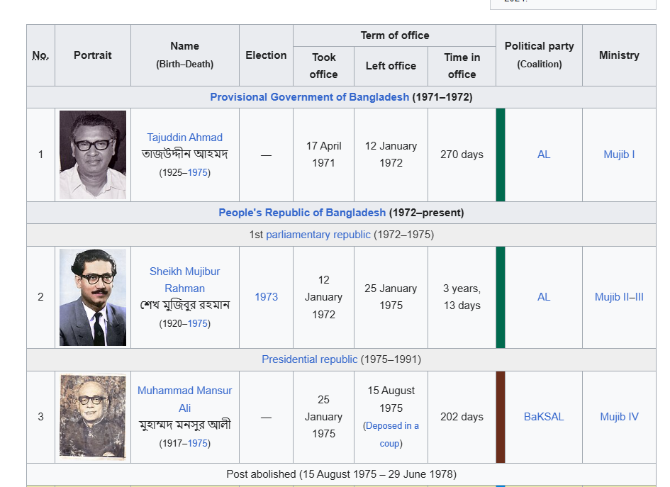

#1) No column headings 

 

Souce: https://en.wikipedia.org/wiki/List_of_prime_ministers_of_India (table 0)

For this case return the JSON row values only:

{
    row1,
    row2,
}

#2) Table w/ colored rows
Source:  

https://en.wikipedia.org/wiki/List_of_governors_of_New_York (Table 0)

Try to pre-parse & populate the table w/ images straight up, delete the solid color lines 

#3) Table w/ Fragmented Rows (IE some rows are row spans)
Source:  

https://en.wikipedia.org/wiki/List_of_prime_ministers_of_Bangladesh (Table 1)

#4) Several images in one table:
Source: 
https://en.wikipedia.org/wiki/List_of_sultans_of_the_Ottoman_Empire 

Notes:
- Wikipedia MP cannot properly parse out the images, import wikipedia